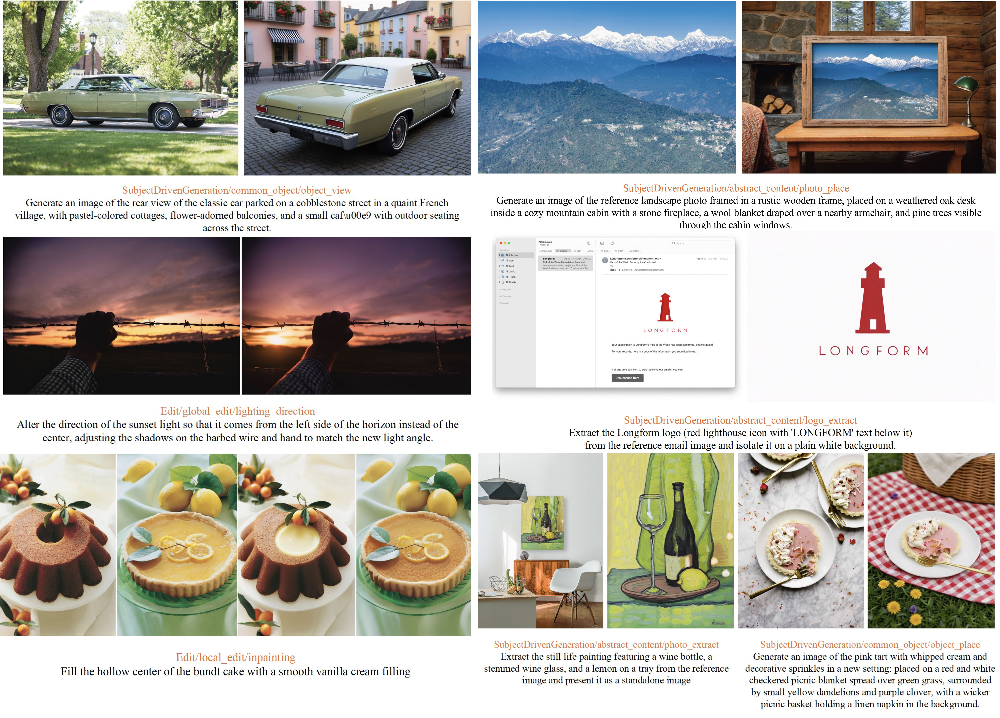
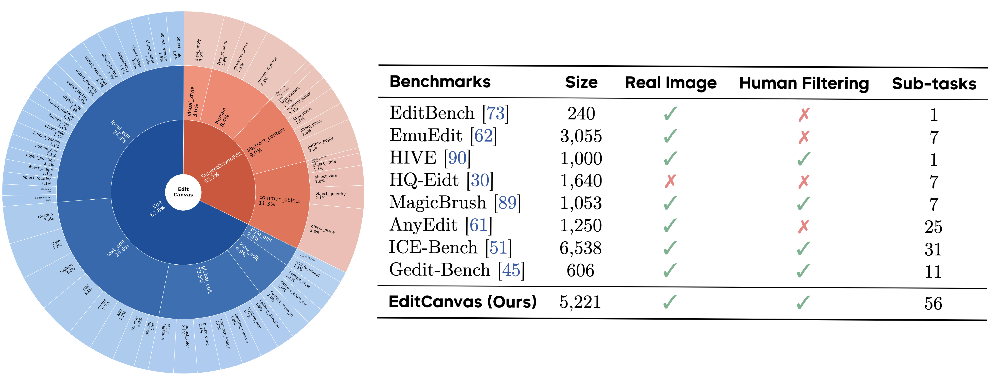
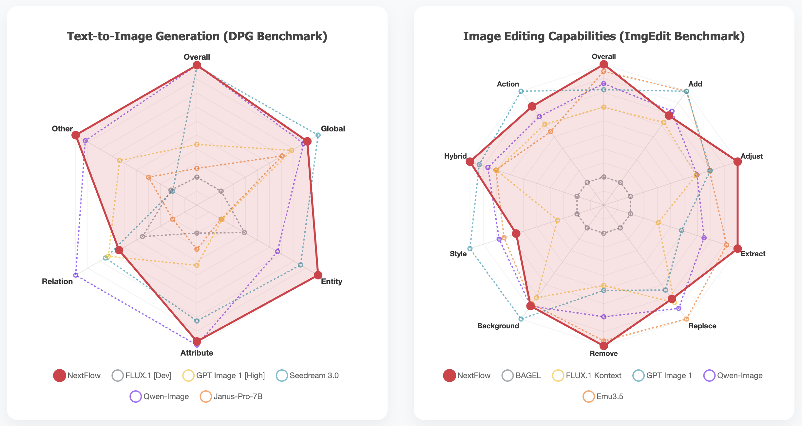
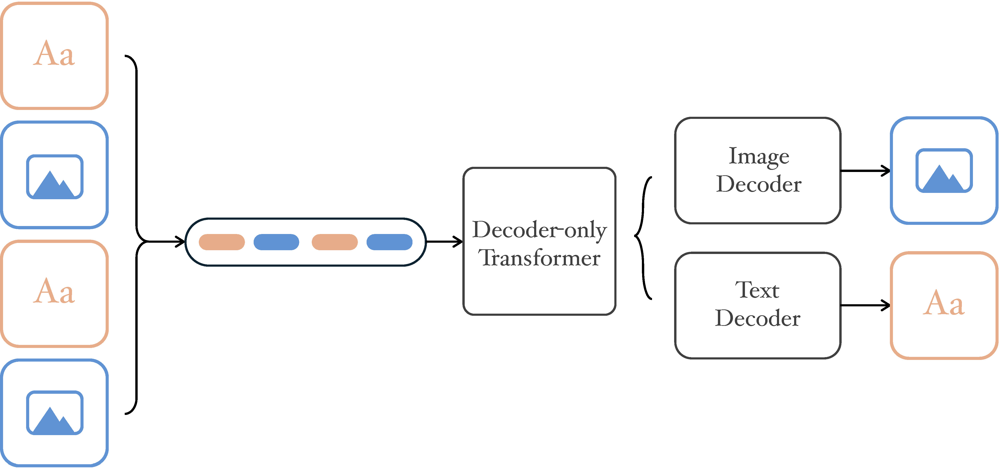
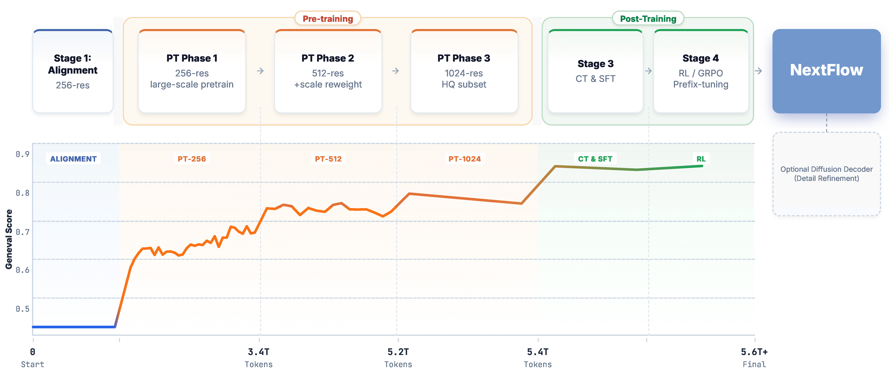

# NextFlow🚀: Unified Sequential Modeling Activates Multimodal Understanding and Generation

<div align="center">

[](https://arxiv.org/abs/2601.02204)&nbsp;
[](https://arxiv.org/abs/2601.02256)&nbsp;


</div>

---

## 🚀 Overview
**NextFlow** is a unified decoder-only autoregressive transformer trained on **6T** interleaved text-image tokens. It bridges the gap between understanding and generation within a single architecture, redefining sequential modeling.

- 🌟 **Unified Architecture:** Seamlessly integrates multimodal generation, editing, and understanding in one decoder-only transformer, removing the need for separate diffusion or LLM backbones.
- 🌟 **Next-Scale Prediction:** A hierarchical prediction paradigm enables generating **1024×1024 images in just 5 seconds**—significantly faster than comparable AR models.
- 🌟 **SOTA Performance:** Achieves state-of-the-art scores on **DPG (88.32)** and **ImgEdit (4.49)**, matching specialized diffusion models in quality while retaining LLM reasoning capabilities.
- 🌟 **Advanced Capabilities:** Unlocks native Chain-of-Thought (CoT) reasoning, in-context editing, and interleaved generation without re-encoding overhead.


## 🎨 Demo

#### High-Fidelity Generation
NextFlow produces high-fidelity visuals with exceptional prompt adherence, adeptly handling complex spatial relationships and cultural nuances.
<div align="center">
    
</div>

#### Complex Instruction Following
The model demonstrates precise alignment between text and images, ensuring accurate representation of detailed descriptions.
<div align="left">
    
</div>

#### Image Editing
NextFlow supports precise, instruction-based editing. It modifies specific regions, styles, or attributes based on natural language commands while preserving the original structure and background consistency.
<div align="center">
    
</div>

#### CoT Reasoning
By handling interleaved sequences naturally, the model employs Chain-of-Thought reasoning to refine prompts and plan before generating visual content.
<div align="center">
    
</div>

#### Interleaved Generation
Leveraging robust in-context learning, NextFlow performs zero-shot image editing and subject-driven generation effortlessly.
<div align="left">
    
</div>

---

## 🏆 Benchmark Evaluation

#### EditCanvas Benchmark
To overcome dataset limitations, we introduce **EditCanvas**, a rigorous benchmark covering Traditional Editing and Subject-Driven Generation across 56 tasks with over 5,000 high-quality samples.
</br>
<div align="center">
    
</div>

#### Comparison with SOTA
We compare **NextFlow** against leading unified models (Bagel, Emu3.5) and specialized diffusion models. On the DPG benchmark, NextFlow RL scores **88.32**, matching Qwen-Image and outperforming all other models. On ImgEdit, it sets a new state-of-the-art with a score of **4.49**.
</br>
<div align="center">
    
</div>

---

### 📖 Introduction of NextFlow
**NextFlow** represents a paradigm shift in autoregressive visual generation. By treating images as hierarchical structures, we achieve specialized diffusion model's quality while keep LLM's reasoning.

##### Model Architecture: Decoder-Only Transformer
Initialized from **Qwen2.5-VL-7B**, NextFlow extends the standard LLM architecture for visual token prediction. We utilize a **Unified Tokenizer**, **Scale Reweighting**, and **Self-Correction with Residual Features** to stabilize large-scale corpus training and achieve high performance.

<div align="center">
    
</div>

##### Training Odyssey
Our pipeline is validated on **6 trillion tokens**, ensuring robust multimodal capabilities.

* **Alignment & Pre-Training:** Large-scale training on text, image-text pairs, and interleaved data.
* **Reinforcement Learning (RL):** We introduce a prefix-tuning strategy for **Group Reward Policy Optimization (GRPO)**, focusing on coarse-scale "prefixes" to stabilize global structure optimization.

<div align="center">
    
</div>

##### Inference Efficiency
NextFlow is highly efficient, enabling thegeneration of 1024 × 1024 images in just 5 seconds—orders of magnitude faster than comparableAR models. And NextFlowrequires **6× fewer FLOPs** than MMDiT-based diffusion models at 1024² resolution. Its next-scale approach enables dynamic resolution generation without the typical computational costs of autoregression.

---

## Citation

```bibtex
@article{zhang2026NextFlow,
      title={NextFlow: Unified Sequential Modeling Activates Multimodal Understanding and Generation}, 
      author={Huichao Zhang and Liao Qu and Yiheng Liu and Hang Chen and Yangyang Song and Yongsheng Dong and Shikun Sun and Xian Li and Xu Wang and Yi Jiang and Hu Ye and Bo Chen and Yiming Gao and Peng Liu and Akide Liu and Zhipeng Yang and Qili Deng and Linjie Xing and Jiyang Liu and Zhao Wang and Yang Zhou and Mingcong Liu and Yi Zhang and Qian He and Xiwei Hu and Zhongqi Qi and Jie Shao and Zhiye Fu and Shuai Wang and Fangmin Chen and Xuezhi Chai and Zhihua Wu and Yitong Wang and Zehuan Yuan and Daniel K. Du and Xinglong Wu},
      year={2026},
      eprint={2601.02204},
      archivePrefix={arXiv},
      primaryClass={cs.CV},
      url={https://arxiv.org/abs/2601.02204}, 
}
```

```bibtex
@article{sun2026varrlrighttackling,
      title={VAR RL Done Right: Tackling Asynchronous Policy Conflicts in Visual Autoregressive Generation}, 
      author={Shikun Sun and Liao Qu and Huichao Zhang and Yiheng Liu and Yangyang Song and Xian Li and Xu Wang and Yi Jiang and Daniel K. Du and Xinglong Wu and Jia Jia},
      year={2026},
      eprint={2601.02256},
      archivePrefix={arXiv},
      primaryClass={cs.CV},
      url={https://arxiv.org/abs/2601.02256}, 
}
```
